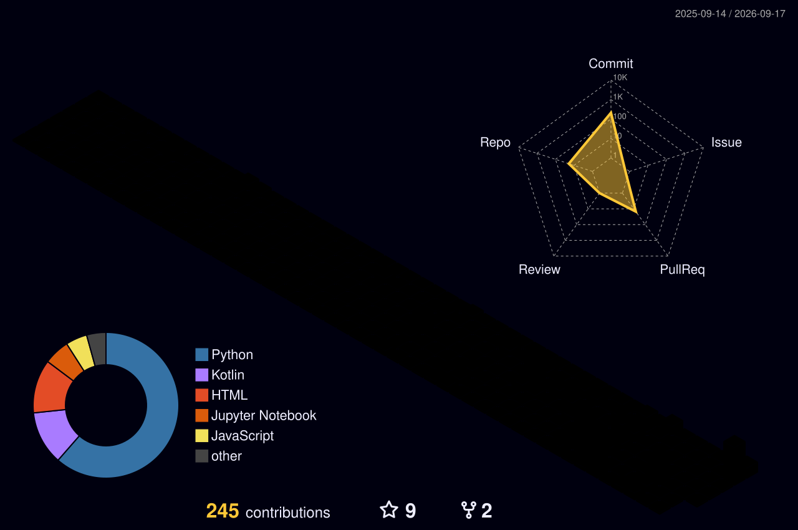

<!-- Header banner (committed SVG, served by GitHub — reliable, no external service) -->

<!-- EDIT ANIMATED TEXT HERE: change the values after lines= below. Separate each line with ; , write spaces as + , and URL-encode symbols (comma = %2C, apostrophe is fine). -->

---

### About me

I'm an ML researcher interested in how neural networks lose stability during training, and how to catch it early. Most of my recent work circles that idea — **[NDEWS](https://github.com/Manas-Maahir/Neural-Degeneration-Early-Warning-System-NDEWS-)**, which forecasts training collapse from representation entropy and gradient diversity, and **[Wafer Defect Detection](https://github.com/Manas-Maahir/Wafer-Defect-Detection-using-EWC)**, a CNN + Swin Transformer hybrid that uses Elastic Weight Consolidation for continual learning.

On the side I build small Android apps in Kotlin, like a [finance tracker](https://github.com/Manas-Maahir/finance-tracker-android) I made because I wanted one that was simple and free.

- 🔬 Currently exploring continual learning, training stability, and lightweight on-device ML
- 🛠️ Open to research collaborations and ML/AI roles
- 📍 Based near Vellore, Tamil Nadu
- 🌐 More of my work lives in my [portfolio](https://github.com/Manas-Maahir/Portfolio)

---

### Tech stack

---

### GitHub stats

<!-- Profile summary cards (auto-generated nightly by GitHub Actions) -->

---

### Snake eating my contributions

<picture>
  <source media="(prefers-color-scheme: dark)" srcset="https://raw.githubusercontent.com/Manas-Maahir/Manas-Maahir/output/github-contribution-grid-snake-dark.svg" />
  <source media="(prefers-color-scheme: light)" srcset="https://raw.githubusercontent.com/Manas-Maahir/Manas-Maahir/output/github-contribution-grid-snake.svg" />
  
</picture>

---

### Coding activity

<!--START_SECTION:waka-->
<!--END_SECTION:waka-->

---

### Detailed metrics

<!-- Generated nightly by the metrics workflow -->

---

### Featured projects

<!-- Star traction for the flagship research project — hidden for now, re-enable later by uncommenting

-->

---

### 3D contribution calendar

---

### Reach out

⭐ If anything here is useful, a star on the relevant repo is the nicest tip.

<!--
=========================================================
 SETUP NOTES (delete this comment block once everything is in place)
=========================================================

All dynamic sections need a one-time setup. Add the workflow files (already in
.github/workflows/) and the secrets below, then trigger each workflow once from
the Actions tab (Run workflow) so the referenced images/branches get created.
Until a workflow's first successful run, its image will show as broken.

1. Snake animation  (.github/workflows/snake.yml)
   - No secrets. Uses the built-in GITHUB_TOKEN.
   - Outputs SVGs to the `output` branch (created automatically on first run).

2. 3D contribution calendar  (.github/workflows/profile-3d.yml)
   - No secrets. Commits SVGs into ./profile-3d-contrib/ nightly.

3. lowlighter/metrics  (.github/workflows/metrics.yml)
   - Add secret METRICS_TOKEN = a classic PAT with scopes: repo, read:user.
   - Commits github-metrics.svg to the repo root.

4. Profile summary cards  (.github/workflows/summary-cards.yml)
   - No secrets. Commits SVGs into ./profile-summary-card-output/ nightly.

5. WakaTime coding stats  (.github/workflows/waka.yml)
   - Sign up at wakatime.com and install the editor plugin.
   - Add secrets: WAKATIME_API_KEY (from wakatime.com/settings/account)
     and GH_TOKEN (a classic PAT with `repo` scope).
   - Fills the START_SECTION:waka / END_SECTION:waka markers above.

6. Self-hosted github-readme-stats (stats card, languages card, project pins)  [DONE]
   - The public github-readme-stats.vercel.app instance is often rate-limited (HTTP 503),
     which breaks all of those images at once. The cards/pins above now point at a
     self-hosted instance: github-readme-stats-one-gamma-72.vercel.app
   - That instance was deployed from https://github.com/anuraghazra/github-readme-stats
     with PAT_1 (a classic GitHub PAT) set in Vercel -> Settings -> Environment Variables.
   - If you ever redeploy under a new domain, find-and-replace
     `github-readme-stats-one-gamma-72.vercel.app` here with the new one.

Theme note: every widget is on tokyonight / tokyo-night. If you swap, swap them
ALL to keep the look consistent (try dracula, radical, merko, gruvbox).
=========================================================
-->
