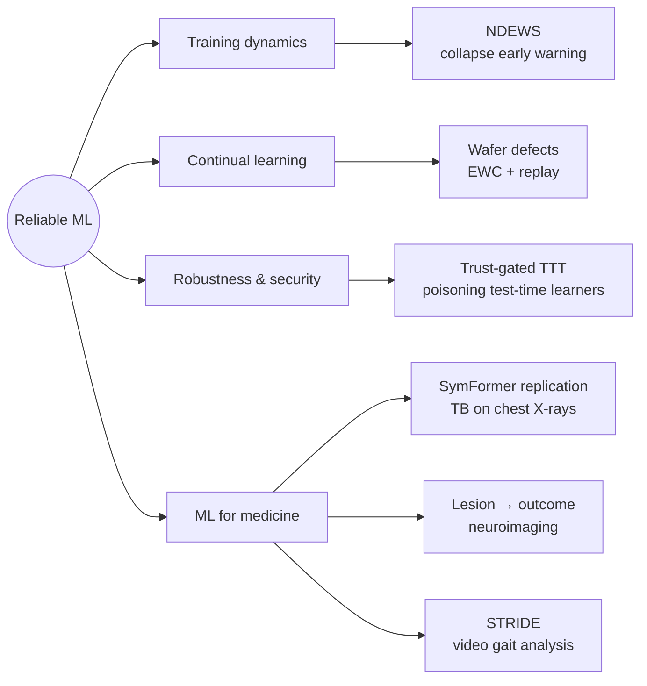
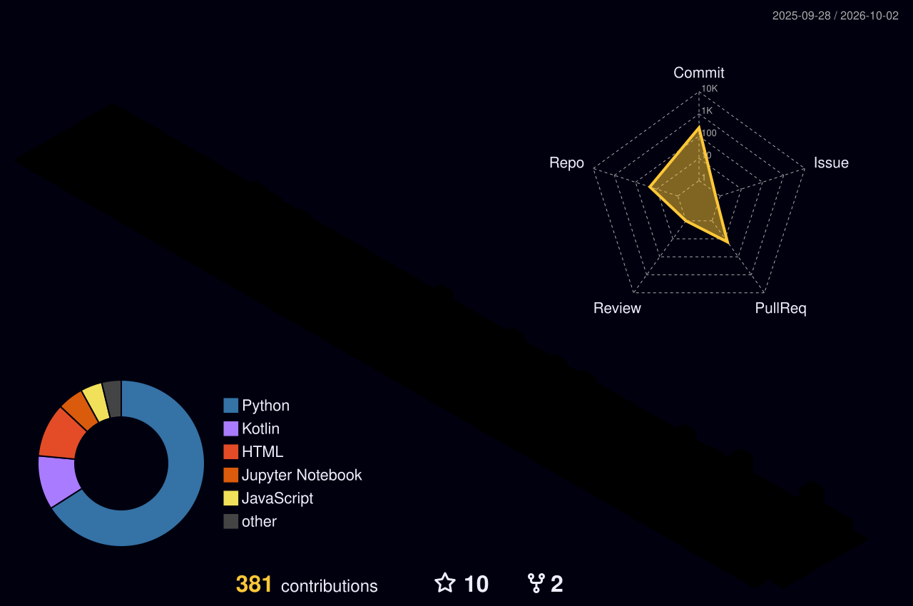

<!-- Header: animated SVG, regenerate with `python scripts/make_banners.py` -->
<picture>
  <source media="(prefers-color-scheme: dark)" srcset="assets/header-dark.svg" />
  <source media="(prefers-color-scheme: light)" srcset="assets/header-light.svg" />
  
</picture>

<div align="center">

<!-- EDIT "NOW" LINES HERE: separate lines with ; write spaces as + and URL-encode symbols (comma = %2C) -->
[](https://github.com/Manas-Maahir/Trust-Gated-Fast-Weight-Updates-for-TTT-E2E-LLMs)

[](https://manasmaahir.vercel.app/)
[](https://www.linkedin.com/in/manas-maahir-03aab328a)
[](mailto:manasmaahir27@gmail.com)

</div>

I study **how neural networks fail during training — and build tools that see it coming.** My work sits where training dynamics, continual learning and ML reliability meet, with side quests into medical imaging and Android apps.

Open to **research collaborations** and **ML/AI roles**.

## 🔬 Research

| Project | The question | Where it stands |
| --- | --- | --- |
| **[NDEWS](https://github.com/Manas-Maahir/Neural-Degeneration-Early-Warning-System-NDEWS-)**<br><sub>training-collapse early warning</sub> | Can a network's internal signals (representation entropy, gradient diversity, neuron sparsity and three more) predict collapse *before* validation accuracy drops? | 🚧 `CollapseMonitor` library done; held-out evaluation (leave-one-run-out, 9 failure regimes, vs. baselines) built — results pending |
| **[Trust-Gated TTT](https://github.com/Manas-Maahir/Trust-Gated-Fast-Weight-Updates-for-TTT-E2E-LLMs)**<br><sub>security of test-time training</sub> | A model that learns while it serves can be poisoned. Can a benign-looking input stream corrupt [TTT-E2E](https://arxiv.org/abs/2512.23675) fast weights — and can a trust gate stop it? | 🚧 Pre-registered attack experiment; the defense only gets built if the attack is shown to work |
| **[Wafer defect detection](https://github.com/Manas-Maahir/Wafer-Defect-Detection-using-EWC)**<br><sub>continual learning</sub> | CNN + Swin Transformer on polar-transformed wafer maps, with EWC + replay so new defect types don't erase old ones | **83.19%** val. accuracy · macro-AUC **0.978** on WM-811K |
| **[SymFormer replication](https://github.com/Manas-Maahir/FOP)**<br><sub>TB detection, TPAMI 2023</sub> | Does the SAS block behind the paper's gains ([arXiv:2307.02848](https://arxiv.org/abs/2307.02848)) survive an independent replication? | Full pipeline + 6 ablations — the trend **did not reproduce**: a clean, reported null result |
| **[Lesion → Disconnection → Outcome](https://github.com/Manas-Maahir/SLP)**<br><sub>neuroimaging</sub> | Turn a brain-lesion mask into a white-matter disconnection profile, then predict clinical outcome from it | Research pipeline (not a diagnostic device) |

<details>
<summary><b>How it fits together</b></summary>


```mermaid
flowchart LR
    R(("Reliable ML"))
    R --> TD["Training dynamics"]
    R --> CL["Continual learning"]
    R --> SEC["Robustness & security"]
    R --> MED["ML for medicine"]
    TD --> NDEWS["NDEWS<br/>collapse early warning"]
    CL --> WAF["Wafer defects<br/>EWC + replay"]
    SEC --> TTT["Trust-gated TTT<br/>poisoning test-time learners"]
    MED --> FOP["SymFormer replication<br/>TB on chest X-rays"]
    MED --> SLP["Lesion → outcome<br/>neuroimaging"]
    MED --> STRIDE["STRIDE<br/>video gait analysis"]
```

</details>

## 🧭 How I work

- **Decide what counts as success before running anything.** Trust-Gated TTT has a [pre-registered kill-gate](https://github.com/Manas-Maahir/Trust-Gated-Fast-Weight-Updates-for-TTT-E2E-LLMs/blob/HEAD/experiments/001-attack-spike/PREREGISTERED.md): if no benign-looking stream corrupts the fast weights past a threshold fixed in advance, the project stops.
- **Report null results.** My [SymFormer replication](https://github.com/Manas-Maahir/FOP/blob/HEAD/report.md) found the paper's trend didn't hold at my scale, and the write-up says so up front.
- **Beat the simple baseline, on runs the model never saw.** NDEWS only counts if it beats a plain "validation accuracy dropped" alert on F1 and ROC-AUC, under leave-one-run-out evaluation.
- **Be clear about what a tool isn't.** [SLP](https://github.com/Manas-Maahir/SLP) is labelled a research tool, not a diagnostic device, and de-identifies patient data before anything else touches it.

## 🛠️ Things I've built

| Project | What it does | Stack |
| --- | --- | --- |
| **[STRIDE](https://github.com/Manas-Maahir/Gait-Analysis)** | Clinical gait metrics from a single video of a 6 m walk test, for Parkinson's research — flags freezing, asymmetry and sway | Python · computer vision |
| **[GitSight](https://github.com/Manas-Maahir/GitSight)** | Fair, multi-factor analysis of who actually contributed to a repo — beyond raw commit counts | Python |
| **[Finance tracker](https://github.com/Manas-Maahir/finance-tracker-android)** | A wallet app I built for myself because the existing ones are too complex or paywalled | Kotlin · Android |
| **[MuBo](https://github.com/Manas-Maahir/MuBo)** | Generates evolving lo-fi MIDI sessions with seamless real-time playback | Python · FluidSynth |
| **[CPU scheduling visualizer](https://github.com/Manas-Maahir/OS-algorithms-visualization-)** | Interactive simulator for OS scheduling algorithms | JavaScript |

## ⚡ Recently working on

<!-- Updated every 6 hours by .github/workflows/activity.yml -->
<!--START_SECTION:activity-->
- **[Trust-Gated-Fast-Weight-Updates-for-TTT-E2E-LLMs](https://github.com/Manas-Maahir/Trust-Gated-Fast-Weight-Updates-for-TTT-E2E-LLMs)** — Poisoning the LLM  
  <sub>13 pushes · last active Sep 29</sub>
- **[neetcode-submissions](https://github.com/Manas-Maahir/neetcode-submissions)** — My NeetCode.io problem submissions  
  <sub>📢 just open-sourced · 12 pushes · last active Sep 28</sub>
- **[SLP](https://github.com/Manas-Maahir/SLP)**  
  <sub>last active Sep 28</sub>
<!--END_SECTION:activity-->

## 🧰 Tools

<div align="center">

<sub><b>ML & research</b></sub><br>
<picture>
  <source media="(prefers-color-scheme: dark)" srcset="https://skillicons.dev/icons?i=py%2Cpytorch%2Ctensorflow%2Csklearn%2Copencv%2Clatex&theme=dark" />
  <source media="(prefers-color-scheme: light)" srcset="https://skillicons.dev/icons?i=py%2Cpytorch%2Ctensorflow%2Csklearn%2Copencv%2Clatex&theme=light" />
  
</picture>

<sub><b>Apps & backend</b></sub><br>
<picture>
  <source media="(prefers-color-scheme: dark)" srcset="https://skillicons.dev/icons?i=kotlin%2Candroidstudio%2Cfastapi%2Creact%2Cts%2Cjs%2Cvite%2Ctailwind%2Chtml%2Ccss&theme=dark" />
  <source media="(prefers-color-scheme: light)" srcset="https://skillicons.dev/icons?i=kotlin%2Candroidstudio%2Cfastapi%2Creact%2Cts%2Cjs%2Cvite%2Ctailwind%2Chtml%2Ccss&theme=light" />
  
</picture>

<sub><b>Tooling</b></sub><br>
<picture>
  <source media="(prefers-color-scheme: dark)" srcset="https://skillicons.dev/icons?i=docker%2Cgithubactions%2Cgit%2Clinux%2Cbash%2Cvscode%2Cvercel&theme=dark" />
  <source media="(prefers-color-scheme: light)" srcset="https://skillicons.dev/icons?i=docker%2Cgithubactions%2Cgit%2Clinux%2Cbash%2Cvscode%2Cvercel&theme=light" />
  
</picture>

          

</div>

<br>

<div align="center">

<picture>
  <source media="(prefers-color-scheme: dark)" srcset="https://raw.githubusercontent.com/Manas-Maahir/Manas-Maahir/output/github-contribution-grid-snake-dark.svg" />
  <source media="(prefers-color-scheme: light)" srcset="https://raw.githubusercontent.com/Manas-Maahir/Manas-Maahir/output/github-contribution-grid-snake.svg" />
  
</picture>

</div>

## 📊 Stats

<div align="center">

<picture>
  <source media="(prefers-color-scheme: dark)" srcset="https://github-readme-stats-one-gamma-72.vercel.app/api?username=Manas-Maahir&show_icons=true&hide_border=true&include_all_commits=true&count_private=true&rank_icon=github&theme=tokyonight" />
  <source media="(prefers-color-scheme: light)" srcset="https://github-readme-stats-one-gamma-72.vercel.app/api?username=Manas-Maahir&show_icons=true&hide_border=true&include_all_commits=true&count_private=true&rank_icon=github&theme=default" />
  
</picture>
<picture>
  <source media="(prefers-color-scheme: dark)" srcset="https://github-readme-stats-one-gamma-72.vercel.app/api/top-langs/?username=Manas-Maahir&layout=compact&hide_border=true&langs_count=8&theme=tokyonight" />
  <source media="(prefers-color-scheme: light)" srcset="https://github-readme-stats-one-gamma-72.vercel.app/api/top-langs/?username=Manas-Maahir&layout=compact&hide_border=true&langs_count=8&theme=default" />
  
</picture>

</div>

<details>
<summary><b>More stats</b> — streak, coding time, 3D calendar</summary>

<br>

<div align="center">

<picture>
  <source media="(prefers-color-scheme: dark)" srcset="https://streak-stats.demolab.com?user=Manas-Maahir&theme=tokyonight&hide_border=true&date_format=M%20j%5B%2C%20Y%5D" />
  <source media="(prefers-color-scheme: light)" srcset="https://streak-stats.demolab.com?user=Manas-Maahir&theme=default&hide_border=true&date_format=M%20j%5B%2C%20Y%5D" />
  
</picture>

</div>

<!--START_SECTION:waka-->


**I Mostly Code in Python** 

```text
Python                   17 repos            ██████████████░░░░░░░░░░░   54.84 % 
JavaScript               6 repos             █████░░░░░░░░░░░░░░░░░░░░   19.35 % 
HTML                     2 repos             ██░░░░░░░░░░░░░░░░░░░░░░░   06.45 % 
C++                      1 repo              █░░░░░░░░░░░░░░░░░░░░░░░░   03.23 % 
Jupyter Notebook         1 repo              █░░░░░░░░░░░░░░░░░░░░░░░░   03.23 % 
```

 Last Updated on 29/09/2026 07:38:51 UTC
<!--END_SECTION:waka-->

<div align="center">

<picture>
  <source media="(prefers-color-scheme: dark)" srcset="profile-3d-contrib/profile-night-rainbow.svg" />
  <source media="(prefers-color-scheme: light)" srcset="profile-3d-contrib/profile-green-animate.svg" />
  
</picture>

</div>

</details>

<br>

<div align="center">


<sub>⭐ If anything here is useful, a star on the relevant repo is the nicest tip.</sub>

</div>

<picture>
  <source media="(prefers-color-scheme: dark)" srcset="assets/footer-dark.svg" />
  <source media="(prefers-color-scheme: light)" srcset="assets/footer-light.svg" />
  
</picture>
